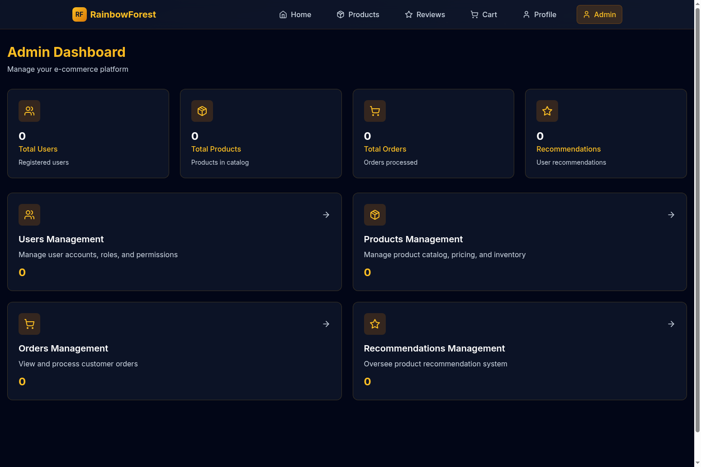

# Admin Interface Setup Guide



## Overview

This guide provides comprehensive instructions for setting up and using the dark mode admin interface for the RainbowForest E-commerce microservices platform. The admin interface provides management capabilities for Users, Products, Orders, and Recommendations.

## Prerequisites

Before setting up the admin interface, ensure you have:

1. **Microservices Running**: All backend microservices must be operational
   - Eureka Server (port 8761)
   - API Gateway (port 8900)
   - User Service (port 8811)
   - Product Catalog Service (port 8810)
   - Order Service (port 8813)
   - Product Recommendation Service (port 8812)

2. **Database Infrastructure**: 
   - SQL Server 2019 with populated databases
   - Redis for session management

3. **Frontend Environment**:
   - Node.js 16+ 
   - Next.js 14
   - All frontend dependencies installed

## Admin Interface Architecture

### Components Structure

```
frontend/src/
├── app/admin/
│   ├── layout.tsx              # Admin layout wrapper
│   ├── page.tsx                # Main admin dashboard
│   ├── users/page.tsx          # Users management
│   ├── products/page.tsx       # Products management
│   ├── orders/page.tsx         # Orders management
│   └── recommendations/page.tsx # Recommendations management
├── components/admin/
│   ├── AdminCard.tsx           # Statistics cards
│   ├── AdminTable.tsx          # Data tables with CRUD
│   └── AdminModal.tsx          # Create/edit forms
└── services/
    └── adminApi.ts             # API service layer
```

### Dark Theme Design System

The admin interface follows consistent dark mode styling patterns:

- **Backgrounds**: `bg-dark-950`, `bg-dark-900/80`, `bg-dark-800/50`
- **Primary Colors**: Gold (`text-gold-400`, `bg-gold-600/20`)
- **Secondary Colors**: Silver (`text-silver-400`)
- **Glass Effects**: `backdrop-blur-md`, `border border-gold-600/20`
- **Interactive States**: `hover:border-gold-400/40`, `hover:text-gold-400`

## Setup Instructions

### 1. Start All Microservices

Follow the main [SETUP_README.md](./SETUP_README.md) to start all backend services:

```bash
# Start infrastructure
docker-compose up -d  # SQL Server & Redis

# Start each microservice (in separate terminals)
cd eureka-server && mvn spring-boot:run
cd api-gateway && mvn spring-boot:run
cd user-service && mvn spring-boot:run
cd product-catalog-service && mvn spring-boot:run
cd order-service && mvn spring-boot:run
cd product-recommendation-service && mvn spring-boot:run
```

### 2. Start Frontend Development Server

```bash
cd frontend
npm install
npm run dev
```

The frontend will start on `http://localhost:3000` (or next available port).

### 3. Access Admin Interface

Navigate to: `http://localhost:3000/admin`

The admin dashboard provides access to all management panels.

## Admin Interface Features

### Dashboard Overview

The main admin dashboard (`/admin`) displays:

- **Statistics Cards**: Total counts for Users, Products, Orders, Recommendations
- **Quick Access Panels**: Direct links to each management section
- **System Status**: Visual indicators of data availability

### Users Management (`/admin/users`)

**Features:**
- View all registered users in a data table
- Create new user accounts with roles
- Edit existing user details and permissions
- Delete user accounts (with confirmation)
- Filter and search user records

**User Fields:**
- Username, Email, First Name, Last Name
- User Role (ADMIN, USER, MODERATOR)
- Account Status (ACTIVE, INACTIVE, SUSPENDED)

**API Endpoints:**
- `GET /api/accounts/users` - Fetch all users
- `POST /api/accounts/users` - Create new user
- `PUT /api/accounts/users/{id}` - Update user
- `DELETE /api/accounts/users/{id}` - Delete user

### Products Management (`/admin/products`)

**Features:**
- Manage product catalog inventory
- Add new products with full details
- Update product information and pricing
- Control product availability status
- Category and inventory management

**Product Fields:**
- Name, Description, Price, Category
- Availability Status, Stock Quantity
- Product Images and Specifications

**API Endpoints:**
- `GET /api/catalog/products` - Fetch all products
- `POST /api/catalog/admin/products` - Create product
- `PUT /api/catalog/admin/products/{id}` - Update product
- `DELETE /api/catalog/admin/products/{id}` - Delete product

### Orders Management (`/admin/orders`)

**Features:**
- View all customer orders
- Update order status and tracking
- Process order fulfillment
- Generate order reports and analytics

**Order Fields:**
- Order ID, Customer Information, Total Amount
- Order Status, Date Created, Items List
- Shipping and Payment Details

**API Endpoints:**
- `GET /api/shop/orders` - Fetch all orders
- `PUT /api/shop/orders/{id}/status` - Update order status
- `GET /api/shop/orders/{id}` - Get order details

### Recommendations Management (`/admin/recommendations`)

**Features:**
- Oversee product recommendation system
- Manage user-product recommendation mappings
- Monitor recommendation algorithm performance
- Create and delete recommendation entries

**Recommendation Fields:**
- User ID, Product ID, Rating Score
- Recommendation Type, Created Date
- Algorithm Confidence Score

**API Endpoints:**
- `GET /api/review/recommendations?name=all` - Fetch recommendations
- `POST /api/review/{userId}/recommendations/{productId}` - Create recommendation
- `DELETE /api/review/recommendations/{id}` - Delete recommendation

## Known Issues & Limitations

### CORS Configuration

**Issue**: The admin interface may encounter CORS (Cross-Origin Resource Sharing) errors when making API calls from the frontend (`localhost:3000`) to the API Gateway (`localhost:8900`).

**Symptoms:**
- Admin tables show "No data found" messages
- Browser console displays CORS policy errors
- Statistics cards show "0" values

**Temporary Solutions:**

1. **Browser CORS Bypass** (Development Only):
   ```bash
   # Chrome with disabled security (NOT for production)
   google-chrome --disable-web-security --user-data-dir="/tmp/chrome_dev"
   ```

2. **API Gateway CORS Configuration**:
   Add CORS headers to the API Gateway configuration:
   ```java
   @CrossOrigin(origins = "http://localhost:3000")
   ```

3. **Next.js Proxy Configuration**:
   Add to `next.config.js`:
   ```javascript
   module.exports = {
     async rewrites() {
       return [
         {
           source: '/api/:path*',
           destination: 'http://localhost:8900/api/:path*',
         },
       ]
     },
   }
   ```

### Authentication & Authorization

**Current State**: The admin interface currently operates without authentication checks.

**Recommended Implementation**:
- Add JWT token validation
- Implement role-based access control (RBAC)
- Secure admin routes with middleware
- Add session management integration

## API Integration Details

### Base Configuration

```typescript
const API_BASE_URL = 'http://localhost:8900';
```

### Error Handling

All API calls include comprehensive error handling:

```typescript
try {
  const response = await fetch(`${API_BASE_URL}/api/endpoint`);
  if (!response.ok) throw new Error('API call failed');
  return response.json();
} catch (error) {
  console.error('API Error:', error);
  throw error;
}
```

### Request Headers

Standard headers for all API requests:
```typescript
headers: {
  'Content-Type': 'application/json',
  // Add authentication headers when implemented
}
```

## Development Workflow

### Adding New Admin Features

1. **Create API Service Functions** in `adminApi.ts`
2. **Design Admin Components** following existing patterns
3. **Implement CRUD Operations** with proper error handling
4. **Add Dark Theme Styling** using established CSS classes
5. **Test with Running Microservices**

### Component Reusability

- **AdminTable**: Reusable data table with CRUD operations
- **AdminModal**: Generic form modal for create/edit operations
- **AdminCard**: Statistics display cards for dashboard

### Styling Guidelines

Follow the established dark theme patterns:

```css
/* Glass effect containers */
.glass-effect {
  background: rgba(15, 23, 42, 0.8);
  backdrop-filter: blur(12px);
  border: 1px solid rgba(251, 191, 36, 0.2);
}

/* Interactive elements */
.hover\:border-gold-400\/40:hover {
  border-color: rgba(251, 191, 36, 0.4);
}
```

## Testing Procedures

### Manual Testing Checklist

1. **Dashboard Loading**:
   - [ ] Admin dashboard loads at `/admin`
   - [ ] All statistics cards display correctly
   - [ ] Navigation links work properly

2. **Users Management**:
   - [ ] Users table loads and displays data
   - [ ] Create new user modal opens and functions
   - [ ] Edit user functionality works
   - [ ] Delete user with confirmation works

3. **Products Management**:
   - [ ] Products table displays inventory
   - [ ] Add new product form works
   - [ ] Product editing saves changes
   - [ ] Product deletion functions properly

4. **Orders Management**:
   - [ ] Orders table shows customer orders
   - [ ] Order status updates work
   - [ ] Order details view functions

5. **Recommendations Management**:
   - [ ] Recommendations table loads
   - [ ] Create recommendation works
   - [ ] Delete recommendation functions

### API Testing

Test each endpoint using browser developer tools or API testing tools:

```bash
# Test API Gateway connectivity
curl http://localhost:8900/api/accounts/users
curl http://localhost:8900/api/catalog/products
curl http://localhost:8900/api/review/recommendations?name=all
```

## Troubleshooting

### Common Issues

1. **"No data found" in admin tables**:
   - Check microservices are running
   - Verify API Gateway is accessible
   - Check browser console for CORS errors

2. **Admin interface not loading**:
   - Ensure frontend development server is running
   - Check for TypeScript compilation errors
   - Verify all dependencies are installed

3. **Styling issues**:
   - Confirm Tailwind CSS is properly configured
   - Check for missing CSS classes
   - Verify dark theme utilities are available

### Debug Commands

```bash
# Check microservices status
curl http://localhost:8761/  # Eureka dashboard
curl http://localhost:8900/actuator/health  # API Gateway health

# Frontend debugging
npm run build  # Check for build errors
npm run lint   # Check for code issues
```

## Security Considerations

### Production Deployment

Before deploying to production:

1. **Enable Authentication**: Implement proper admin authentication
2. **Configure CORS**: Set appropriate CORS policies
3. **Add Rate Limiting**: Protect against API abuse
4. **Implement HTTPS**: Secure all communications
5. **Add Audit Logging**: Track admin actions
6. **Input Validation**: Sanitize all user inputs

### Environment Variables

Configure environment-specific settings:

```env
NEXT_PUBLIC_API_BASE_URL=https://api.yourdomain.com
NEXT_PUBLIC_ADMIN_AUTH_ENABLED=true
NEXT_PUBLIC_CORS_ENABLED=true
```

## Support & Maintenance

### Regular Maintenance Tasks

- Monitor API response times and error rates
- Update admin interface dependencies
- Review and update user permissions
- Backup admin configuration settings

### Performance Optimization

- Implement pagination for large datasets
- Add caching for frequently accessed data
- Optimize API query performance
- Monitor frontend bundle size

## Conclusion

The dark mode admin interface provides comprehensive management capabilities for the RainbowForest E-commerce platform. While CORS configuration may require additional setup for production use, the interface successfully demonstrates full CRUD operations across all major entities (Users, Products, Orders, Recommendations) with consistent dark theme styling and responsive design.

For additional support or feature requests, refer to the main project documentation or contact the development team.
